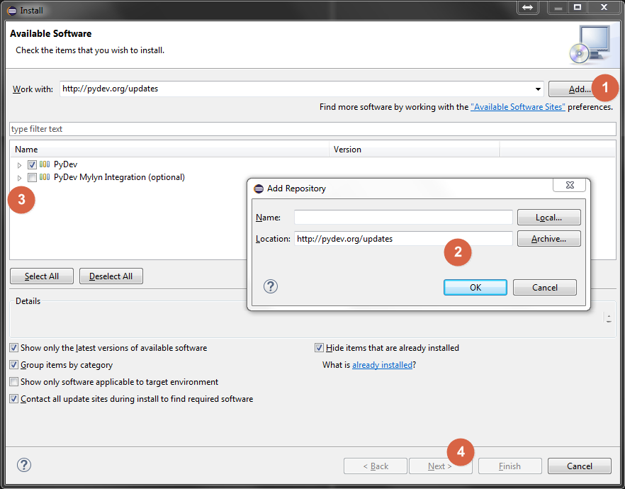
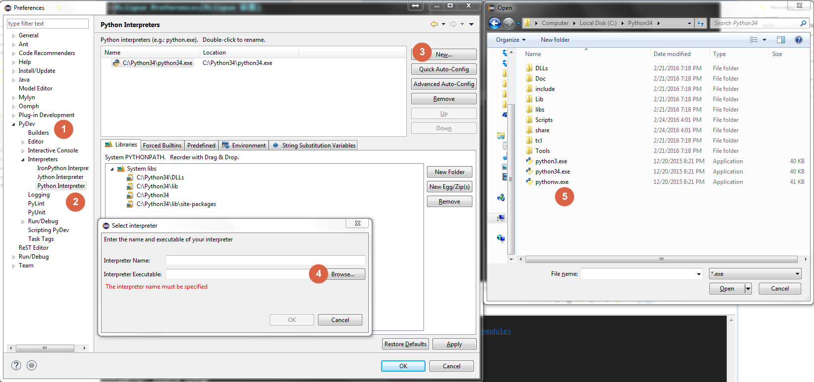

使用Eclipse开发环境进行Python开发
==============================================================================

Eclipse是一个通用的IDLE框架, 通过安装不同的插件, 可以用来开发C++, Java, Python, PHP 等很多语言。

(在你的机器性能允许的情况下, PyCharm是开发的第一选择, 教程在此: https://github.com/MacHu-GWU/Dev-Exp-Share/tree/master/IDLE/PyCharm)

Pydev(安装Pydev)
------------------------------------------------------------------------------

Pydev (主页 http://www.pydev.org/) 是把Eclipse变成Python IDE的插件。

安装方法如下:

Menu -> Install New Software -> 添加更新源 http://www.pydev.org/updates/

然后我们需要告诉Pydev我们使用哪个版本的Python解释器。

Eclipse Preferences(Eclipse 设置)
------------------------------------------------------------------------------

Encoding(文本编码)
~~~~~~~~~~~~~~~~~~~~~~~~~~~~~~~~~~~~~~~~~~~~~~~~~~~~~~~~~~~~~~~~~~~~~~~~~~~~~~

确保你创建的每一个文本文件都是utf-8编码。设置方法:

- Preferences -> General -> Editor -> Text Editor -> Spelling -> Encoding: Default (UTF-8)
- Preferences -> General -> Workspace -> Text file encoding: Other (UTF-8)

Font
~~~~~~~~~~~~~~~~~~~~~~~~~~~~~~~~~~~~~~~~~~~~~~~~~~~~~~~~~~~~~~~~~~~~~~~~~~~~~~

YaHei.Consolas.1.12字体是一款结合了微软等宽编程字体Consola和中文等宽雅黑字体的编程字体。

- Preference -> General -> Appearance -> Colors and Fonts -> Basic -> Text Font

Navigator
~~~~~~~~~~~~~~~~~~~~~~~~~~~~~~~~~~~~~~~~~~~~~~~~~~~~~~~~~~~~~~~~~~~~~~~~~~~~~~

Eclipse默认的文件浏览器视图是Package Explorer, 这个视图不支持对文件进行按文件类型排序。而Navigator是一个高级的视图, 有多种排序和文件过滤的选项。所以在开发过程中, 推荐使用Navigator视图作为文件浏览器。

- Menu -> Navigate -> Show In -> Navigator

Python Editor Color Theme
~~~~~~~~~~~~~~~~~~~~~~~~~~~~~~~~~~~~~~~~~~~~~~~~~~~~~~~~~~~~~~~~~~~~~~~~~~~~~~

一款美观的配色方案能够帮助开发者更容易地阅读代码。在安装了Eclipse Color Themes插件之后就有多种配色方案可供选择。而我个人最喜欢的配色方案是在Sublime Text Monokai Extended配色方案上稍作修改:

- 代码: 白色
- 注释: 橙色
- 字符串: 亮黄
- 关键字: 亮蓝
- 类名: 粉色
- 方法名: 亮绿色

Plugins(插件)
------------------------------------------------------------------------------

同Sublime Text一样, Eclipse也有大量的插件可供使用。

Eclipse Color Themes
~~~~~~~~~~~~~~~~~~~~~~~~~~~~~~~~~~~~~~~~~~~~~~~~~~~~~~~~~~~~~~~~~~~~~~~~~~~~~~

这个插件提供了多种经典的文本编辑器语法高亮和配色方案。

- Update: http://eclipse-color-theme.github.io/update/
- Homepage: http://eclipsecolorthemes.org/
- Settings: Preferences -> General -> Color Theme

My favorite Themes: Sublime Text Monokai Extended
My favorite Python Editor Color Themes:

- Code: White
- Keyword: Light Blue
- Unicode: Light Yellow
- Comment: Orange
- Class Name: Dark Blue
- Function Name: Light Green
- Others: Use Default Sublime Text Monokai Extended

Indent Guide
~~~~~~~~~~~~~~~~~~~~~~~~~~~~~~~~~~~~~~~~~~~~~~~~~~~~~~~~~~~~~~~~~~~~~~~~~~~~~~

这是一个在侧边栏显示每行的indent情况的插件, 有助于代码块超过一页时, 依然能知道你所在的代码块。

- Update: http://sschaef.github.io/IndentGuide/update/
- Homepage: http://sschaef.github.io/IndentGuide/
- Settings: Preferences -> General -> Editor -> Text Editor -> Indent Guide

ReST Editor
~~~~~~~~~~~~~~~~~~~~~~~~~~~~~~~~~~~~~~~~~~~~~~~~~~~~~~~~~~~~~~~~~~~~~~~~~~~~~~

该插件提供了restructed text的语法高亮。

- Update: http://resteditor.sourceforge.net/eclipse
- Homepage: http://resteditor.sourceforge.net/
- Settings: Preferences -> ReST Editor

Notice: Install this before you change your default color theme

其他技巧
------------------------------------------------------------------------------

Change ``RECENT_WORKSPACES``
~~~~~~~~~~~~~~~~~~~~~~~~~~~~~~~~~~~~~~~~~~~~~~~~~~~~~~~~~~~~~~~~~~~~~~~~~~~~~~

在打开Eclipse时, 会要用户选择Workspace目录。在一个Workspace目录中拥有同一套Preference设定, 对于Python来说, 也就是只能绑定一个Interpreter。不同的Workspace的设定可以不同。由于这点, 所以我们要为我们的Python2/Python3项目设定不同的目录。而在Recent Workspace中会保存你最近的Workspace, 如果你x想清除无用的Workspace, 请参考下面的方法:

Go to your eclipse root directory, edit ``eclipse\configuration\.settings\org.eclipse.ui.ide.prefs``.
