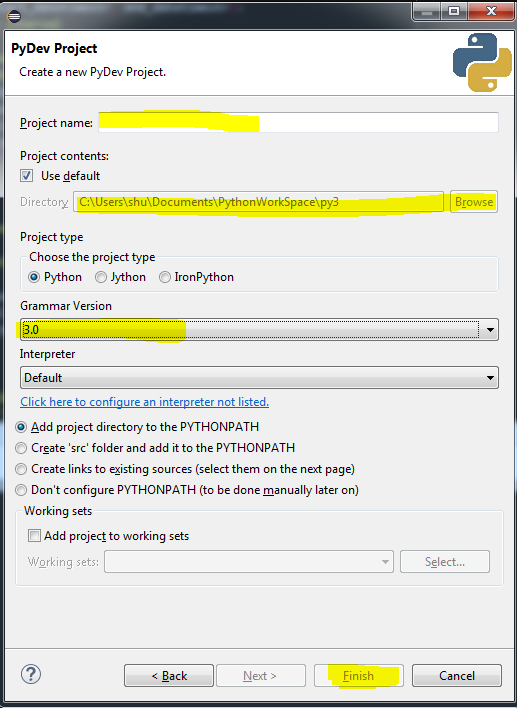

#Setup Environment and Software in Windows for Python Developer
------

##OverView

Software you need:

- Python Interpreter: Python2, Python3. Download Link = [https://www.python.org/](https://www.python.org/)
- Python IDLE: Eclipse. Download Link = [https://www.eclipse.org/](https://www.eclipse.org/)
- Text Editor: Sublime2, Sublime3. Recommend 3. Download Link = [http://www.sublimetext.com/](http://www.sublimetext.com/)
- Version Control: GitHub Client. Download Link = [https://github.com/](https://github.com/)

**需要装的软件**

- Interpreter, 解释器。 也就是Python主程序。 Python3对于非英文字符相关的兼容更佳。 大部分的扩展包都已经兼容了Python3。
- IDLE, 开发环境。 也就是代码编写, 运行, 调试的工具软件。 Eclipse在Windows下比较好用。
- Text Editor, 文本编辑器。 Sublime以其轻量, 快速, 强大的编辑和搜索功能成为了Windows下的首选。
- Version Control, 源代码版本控制。 GitHub云端同步, 无需多说的强大。

##Python Interpreter安装和配置

根据你的操作系统选择32位或64位的安装, 在Win7, Win8, Win10时代通常就用64位版本的吧。 因为只有极少数的扩展包不兼容64位版本。 可以同时安装多个不同大版本的Python。 比如Python34, Python33, Python27, Python26可以共存。 但是Python276, Python271就无法共存。 之后会介绍如何同时管理多个Python版本的方法。

一路Next安装完成Python之后。 右键点击Computer, 选择Property(或进入Control Panel\System and Security\System)。 按照下图设置Windows环境变量, 在Path中添加你所安装的Python版本的路径。 这样你在命令行中输入python, 系统才能够找到对应的python解释器。

**多Python版本兼容**

例如我们安装了Python27和Python33, 我们将C:\Python27和C:\Python33添加到环境变量(中间用分号隔开)。 然后我们回到C:\Python27和C:\Python33中将python.exe分别修改为python2.exe, python3.exe。 以后我们在命令行输入python2就是运行Python27, 输入python3就是运行Python33了。

**运行Python脚本**

例如你有这么一个脚本:
	
	C:\python_project\test.py

内容是:
	
	from __future__ print_function
	print("hello world")	

那么你需要在windows开始菜单中打开控制台(搜索CMD), 输入如下命令:

	cd C:\python_project
	python test.py

那么test.py脚本就被运行了

##Python IDLE安装和配置

Eclipse也分32位和64位。 Win7版本以上就都用64位的吧! 下不冗述。

Eclipse安装完之后很多人会碰到找不到JRE的问题。 因为Eclipse本身就是一个用JAVA编写的软件, 所以需要JAVA Runtime Environment(JRE)。 关于JRE和JDK的区别是: 如果你有依赖于JAVA运行环境的软件, 而不需要用JAVA进行开发, 那么JRE就够了。 如果你是JAVA程序员, 那么你还需要安装JDK。

至于JRE的下载, 只需要Google JRE7 download即可。 下载时注意选择跟你Eclipse的版本一致即可。 下载链接 = [http://www.oracle.com/technetwork/java/javase/downloads/jre7-downloads-1880261.html](http://www.oracle.com/technetwork/java/javase/downloads/jre7-downloads-1880261.html)

**配置Pydev和Python解释器**

Eclipse仅仅是一个IDLE, 换言之可以用Eclipse来开发Python, Java, PHP, C++等很多语言。而如果要开发Python, 则我们需要安装[Pydev](http://pydev.org/)插件。安装方法如下

- 选项卡 -> Help -> Install New Software -> 添加更新源 http://pydev.org/updates

Eclipse需要用户告之用户希望用哪个Python解释器来解释项目中的代码。

- 关联Python解释器

关联以后, 我们就可以创建Python项目了。

- 选项卡 -> File -> New -> Project -> Pydev -> Pydev Project -> 选择项目目录, 项目名, 语法版本

之后我们就可以用Ctrl-F11运行脚本, 以及F11进行debug了

**字体**

写程序都希望代码都整整齐齐的, 所以等宽字体是必须的。但是为了让中英文的字体保持和谐, 推荐使用“微软雅黑Consola混合字体”。效果如下

1. 解压files\YaHei.Consolas.1.12.zip
2. 将解压好的文件放到C:\Windows\Fonts目录下
3. 然后到eclipse的windows选项卡中选择preference, 设置默认字体为YaHei.Consolas
	

**文本编码**

为了保持所有语言兼容, 建议修改默认编码为UTF-8。一共有两处需要修改, 同样在windows -> perference中设置:

**颜色主题**

对于长时间坐在电脑前的脑力工作者来说, 用一个舒服的配色方案能有效的保护眼睛和提高效率。[http://eclipsecolorthemes.org/](http://eclipsecolorthemes.org/) 提供了多种主题的下载和安装。具体安装方法如下:

- 选项卡 -> Help -> Install New Software, 然后添加更新源 http://eclipse-color-theme.github.io/update/, 一路Next即可

- 到 Preference 中选择你喜欢的主题。(个人最喜欢在Sublime Text Monokai Extended的基础上略微修改一点)

- 个人最喜欢的设置

**缩进助手**

由于Python是用缩进风格定义代码块的, 所以缩进提示就显得非常有用了。[http://sschaef.github.io/IndentGuide/](http://sschaef.github.io/IndentGuide/) 提供了这一功能。类似于颜色主题的安装, 我们同样可以通过添加更新源的方式安装。更新源为 sschaef.github.io/IndentGuide/update。更新完之后进到Preference中检查, 如果跟下图显示的一样, 就说明安装成功了。

**Navigator**

对于左边的项目文件浏览器, 我相信很多人都想要按照文件类型分类排列, 或者自定义增加一些filter。这一功不能用Package Explorer或Project Explorer实现。需要用到Navigator。打开Navigator视图的方法如下:

	选项卡 -> Navigate -> Show in -> Navigator

然后你就可以在Navigator中的View Menu中对视图进行设置了

**显示标尺**

在很多大公司都有代码规范。比如一行代码不得超过80个字符。那么在编辑器中我们可以添加一个竖标尺作为参考。具体设置方法是:

	Preference -> General -> Editor -> Text Editor -> Show Print Margin 然后设置你想要的标尺位置

**显示行号**

	跟显示标尺一样, 在Text Editor中设置Show Line Number即可

**Outline视图**

当一个文件的代码变得很长时, Outline可以以函数, 类为最小单位, 像一个文档结构图一样显示代码的框架。而你可以通过点击快速在代码中间的函数和类跳转。 具体设置方法:

	选项卡 -> Windows -> Show View -> Outline

**打开Python Shell**

- 打开Python Shell输入短短的代码进行调试
- 同时运行多个脚本, 然后在多个脚本之间的控制台进行跳转, 观看各个脚本的运行状态
- 停止运行单个或多个脚本
- 让控制台不再打印字符

这些功能都可以在下图的功能按钮处实现

**Eclipse使用过的Workspace历史记录保存的位置**

当我们有多个工作目录时, 我们有时候想要删除掉这些历史记录。具体做法是找到Preference的配置文件, 然后修改即可。这个文件在:

	eclipse\configuration\.settings\org.eclipse.ui.ide.prefs

##Text Editor安装和配置

Sublime3的安装和配置请参考我的另一篇文章。[链接](https://github.com/MacHu-GWU/Learn-Sublime_My-favorite-text-editor/blob/master/Setup_SublimeText3_for_Python_Developer.md)

##Version Control安装配置

Github Client的使用请参考网络其他Git命令相关的文章和Github官方文档